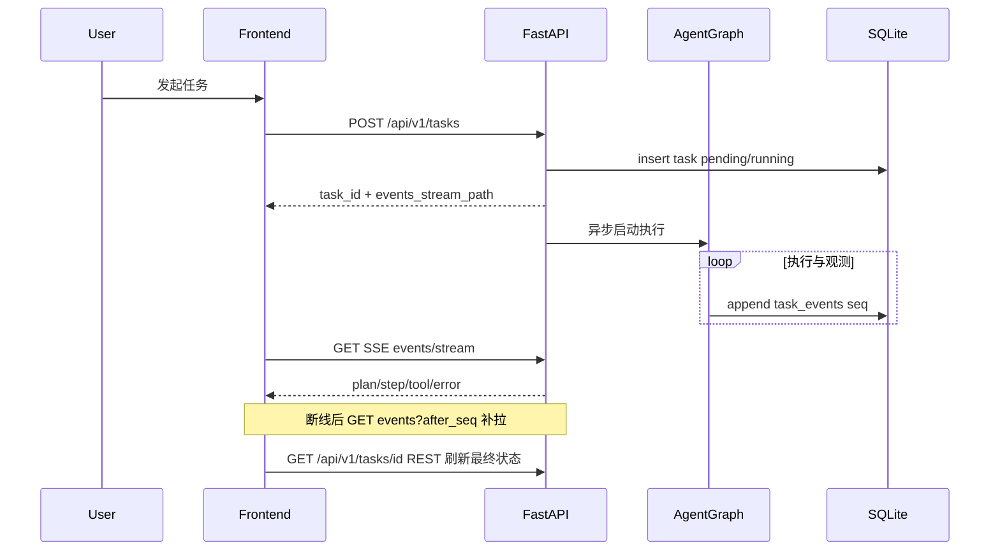

# ForgeAgent 全栈开发顺序（MVP）

本文档描述 **实施顺序、里程碑、业务流程**；契约见 [`API.md`](../api/API.md)，页面见 [`PAGES.md`](./PAGES.md)，边界见 [`PRD.md`](../product/PRD.md)。可含 **伪代码**，**不包含可运行实现代码**。

---

## 1. 版本与环境基线

| 层级     | 基线                         | 说明                                                                                                                                                                                            |
| -------- | ---------------------------- | ----------------------------------------------------------------------------------------------------------------------------------------------------------------------------------------------- |
| Python   | `>=3.11`（建议 3.12）        | 与 [`backend/pyproject.toml`](../../backend/pyproject.toml) `requires-python` 一致                                                                                                                 |
| Node     | 20 LTS 或 22 LTS             | 与 [`TECH_DESIGN.md`](../architecture/TECH_DESIGN.md) §6、[`frontend/package.json`](../../frontend/package.json) 生态一致                                                                                          |
| 后端依赖 | 当前：`fastapi`、`uvicorn`   | 引入 **SQLAlchemy 2.0 async**、**aiosqlite**、**LangChain/LangGraph**、MCP 适配时，**以官方文档与 `uv add` / `pip` 解析的兼容版本为准**，在本仓库 `pyproject.toml` 中锁范围并跑通导入与最小用例 |
| 前端依赖 | React 19、Vite 8、Tailwind 4 | 按计划增量添加 **react-router**、**@tanstack/react-query**；可选 **zustand**                                                                                                                    |

引入 LangGraph 等新包时，优先查阅各包官方「Getting started」与 **Python 版本矩阵**，避免手写过时 API。

---

## 2. Windows / Git Bash 常用命令示例

在仓库根目录打开 **Git Bash**（路径无空格为佳）：

```bash
# 前端（仅 frontend 目录）
cd frontend
npm install
npm run dev
```

```bash
# 后端：虚拟环境与可编辑安装
cd backend
python -m venv .venv
source .venv/Scripts/activate   # Git Bash
pip install -e .
uvicorn app.main:app --reload --host 127.0.0.1 --port 8000
```

若使用 **uv**：`uv venv`、`uv pip install -e .` 等价替代；以团队统一工具为准。

环境变量：从仓库根复制 `.env.example` → `.env`；**机密仅在后端进程与部署环境**，前端仅 `VITE_API_BASE_URL` 等非密钥（见 [`TECH_DESIGN.md`](../architecture/TECH_DESIGN.md) §6）。

---

## 3. 阶段划分与里程碑

| 阶段  | 焦点               | 里程碑（验收）                                                                                                                                                                                            |
| ----- | ------------------ | --------------------------------------------------------------------------------------------------------------------------------------------------------------------------------------------------------- |
| **0** | 仓库与环境         | Git Bash 下前端 `npm run dev`、后端 `uvicorn` 可访问 `GET /health`；无密钥进前端构建产物                                                                                                                  |
| **1** | 数据层             | SQLite + SQLAlchemy 2.0 async；表 `tasks`、`task_events`、`sessions`、`messages`、`settings_kv` 可迁移/创建并可读写；同一 `task_id` 下 `seq` **严格递增、唯一**                                           |
| **2** | HTTP API（非流式） | FastAPI + Pydantic 覆盖 [`API.md`](../api/API.md) 中 REST 部分（会话、任务 CR、事件 GET、设置、工具列表）；可先对任务执行 **mock**；OpenAPI 文档可导出                                                           |
| **3** | 工具注册表 + MCP   | 启动或按需刷新：内置工具 + **至少一种** 真实 MCP 或文档化 mock；`GET /api/v1/tools` 与注册表一致；Skills 约定加载后进入同一注册表（`source=skill`）                                                       |
| **4** | Agent 运行时       | LangGraph **最小图**：Planner → Executor → 条件边重规划；配置 `max_replan_attempts`；每次重规划 `plan_version++` 并写 `task_events`（`kind=replan`）；任务终态 `success`/`failed` 与 `error_message` 一致 |
| **5** | SSE                | `POST /tasks` 触发的执行与 `GET .../events/stream` 事件顺序一致；客户端断线后 `after_seq` 补拉语义明确                                                                                                    |
| **6** | 前端壳             | React Router 挂载 [`PAGES.md`](./PAGES.md) 路由；TanStack Query 请求封装（`VITE_API_BASE_URL`）；布局与导航                                                                                                 |
| **7** | 前端监控闭环       | 任务详情页 SSE + 时间线；错误与高亮；列表/详情性能满足 PRD（摘要、分页）                                                                                                                                  |
| **8** | 质量与验收         | **手工与评审**：以 §6 清单、`task_id + seq` 与 OpenAPI/API 文档在联调中一致为准；迭代中可按需恢复自动化测试                                                                                                           |

---

## 4. 核心业务流程

### 4.1 时序（Mermaid）



### 4.2 任务与事件（伪代码）

```text
on POST /tasks(session_id, user_message):
  validate session exists
  insert messages (user)
  task = insert tasks(status=running, plan_version=1)
  schedule background run_agent(task.id)  # asyncio.create_task 或队列
  return { task_id, events_stream_path }

async def run_agent(task_id):
  try:
    append_event(task_id, module=planning, kind=plan_created, payload=...)
    graph = build_min_langgraph(tool_registry)
    for step in graph.run(...):
      append_event(task_id, ...)  # execution / tool / memory
      if should_replan and replan_count < max:
        bump plan_version(task_id)
        append_event(task_id, kind=replan, ...)
    update_task(task_id, status=success)
  except Exception as e:
    append_event(task_id, module=execution, kind=error, payload=sanitize(e))
    update_task(task_id, status=failed, error_message=str(e))

def append_event(task_id, ...):
  seq = next_seq(task_id)  # 原子递增
  insert task_events(task_id, seq, ts=now(), ...)
```

### 4.3 SSE 与补拉（伪代码）

```text
on GET .../events/stream(task_id):
  set headers text/event-stream
  last = load optional Last-Event-ID or query
  for event in subscribe_or_poll(task_id, after_seq=last):
    yield sse(event)

client:
  buffer events by seq
  on disconnect: GET /events?after_seq=max_seen_seq
  reopen EventSource or fetch stream
```

---

## 5. 与工程约定对齐的要点（实现时同步维护 [`docs/backend/业务流程文档.md`](../backend/业务流程文档.md)）

- **FastAPI**：路由分层（`dependencies` 注入 DB session）、Pydantic v2 模型与 `response_model`；异步路由中 **避免** 阻塞 IO。
- **SQLAlchemy 2.0**：`AsyncSession`、声明式模型；迁移可用 Alembic 或 MVP 启动时 `create_all`（团队择一并在仓库约定）。
- **LangGraph**：从 **少节点** 开始；检查点若启用需与任务 `task_id` 可追溯关系文档化。
- **前端**：列表分页；详情事件 `after_seq`；SSE 与 Query 缓存合并策略明确，避免重复或乱序展示。
- **安全**：日志与 `payload_json` 序列化前 **脱敏**；设置 API 拒绝写入密钥字段。

---

## 6. 手工验收清单（PRD 对齐）

1. **创建会话** → **发起任务** → 详情页可见 **计划 → 步骤执行 → 终态**。
2. **进行中** 任务在时间线可见工具调用名与模块标签；**失败** 时可见失败步骤与错误信息。
3. **重规划**（若触发）可见版本递增或 `replan` 事件。
4. **设置页** 可保存非密钥配置；**工具列表** 可见 MCP/内置（及 Skill）来源。
5. 浏览器网络面板与仓库中 **无** LLM/MCP 密钥明文。

---

## 7. 明确不在 MVP 范围

与 [`PRD.md`](../product/PRD.md) 一致：**多 Agent 生产编排**、**通用多租户 SaaS**、**完整 OpenTelemetry 全链路**、**完整长期记忆/RAG 治理**、**拖拽式复杂工作流画布** 等 — **默认不做**，勿将其实现为必达路径。

---

_文档版本：MVP 开发顺序；具体包版本以仓库 `pyproject.toml` / `package.json` 及提交时锁定为准。_
